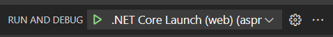
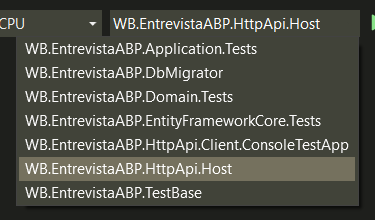
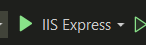
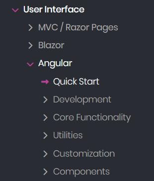
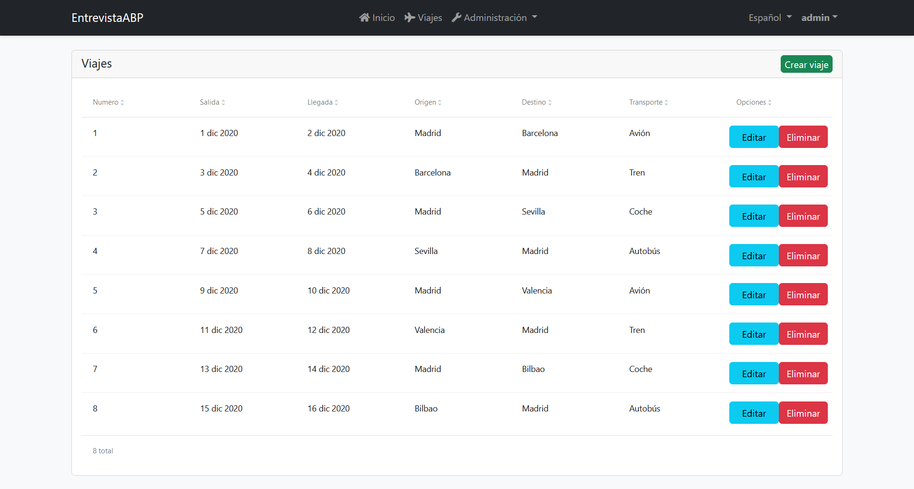

# EntrevistaABP
Proyecto de entrevista para conocimiento de angular y .NET

El proyecto fue creado utilizando el siguiente comando

```abp new WB.EntrevistaABP -u angular -dbms PostgreSQL --theme basic```

## Instalación
Se necesitan los siguientes programas y herammientas:
<!-- Make a table with 3 columns -->
| Programa | Versión | Link |
| -------- | ------- | ---- |
| .NET Core | 7.0 LTS | https://dotnet.microsoft.com/en-us/download/dotnet/7.0 |
| ABP CLI | 7.3.1 | dotnet tool install -g Volo.Abp.Cli --version 7.3.1 |
| EntityFramework | 7.0.5 | dotnet tool install -g dotnet-ef --version 7.0.5 |
| Node.js | 18.17.0 LTS | https://nodejs.org/es/download/ |
| Yarn | 1.22.19 | npm install -g yarn@1.22.19 |
| Docker Desktop | any | https://www.docker.com/products/docker-desktop/ |

1. Ubicar la consola en la carpeta principal del repositorio y ejecutar: ```abp install-libs```
1. En la misma carpeta ejecutar ```docker compose up -d```
1. Acceder a la carpeta ```./asp-net/src/WB.EntrevistaABP.DbMigrator``` y ejecutar ```dotnet run```

## Ejecución
Se deben ejecutar el front end (Angular) y back end (.NET) por separado.

- Para ejecutar angular, ubicar la consola en la carpeta ```./angular/``` y correr ```yarn start```
- Para ejecutar .NET tenemos 3 opciones:
1. Ubicar la consola en la carpeta ```./asp-net/src/WB.EntrevistaABP.HttpApi.Host``` y ejecutar ```dotnet run```
2. Ejecutarlo en Visual Studio Code. Abrir el workspace llamado ```entrevista.code-workspace```. En la sección de debugger hacer click en el icono de play (▶) y seleccionar la opción ```.NET Core Launch (web)```  

3. Ejecutarlo en Visual Studio. Abrir la solución ```./asp-net/WB.EntrevistaAbp.sln```. Seleccionar el proyecto ```WB.EntrevistaABP.HttpApi.Host```  
  
y ejecutar utilizando el boton de play  


La primer opción solo corre el código, mientras que las últimas 2 permiten debuggear el codigo, agregando breakpoints y avanzando línea por línea.

Por defecto el proyecto cuenta con un usuario:
- userName: ```admin```
- password: ```1q2w3E*```

## Documentación
El proyecto utiliza el frameowrk ABP y toda su documentación se puede encontrar en: https://docs.abp.io/en/abp/7.3/

Notar que se fijó en 7.3, nuevas versiones de ABP pueden traer diferencias en implementaciones, asegurarse de utilizar la documentación correcta.

## Breve explicación de la estructura del proyecto
El proyecto se encuentra dividido en 2 carpetas principales: ```./angular/``` y ```./asp-net/```.

### ./angular/
Contiene el front end, es un proyecto angular con algunos paquetes ya provistos por ABP. Cuenta con una implementación de login, de menú y de home. Pueden acceder a más documentación en: https://docs.abp.io/en/abp/latest/UI/Angular/Quick-Start  
Teniendo más información si se accede a sus submenús.  


### ./asp-net/
Contiene el back end, consta de muchos proyectos .NET Core. Estos son:
#### ./asp-net/src/WB.EntrevistaABP.Domain.Shared
Contiene definiciones de constantes y enums que se usan a lo largo del programa. Son cosas que se referencias en muchos otros componentes. (Por ej. el enum que representa el estado de una entidad).

#### ./asp-net/src/WB.EntrevistaABP.Domain
Contiene las definiciones de las entidades, los repositorios y los servicios de dominio. Lo más importante para este desafío son las entidades, todo lo definido aquí debería tener una representación en la base de datos.

#### ./asp-net/src/WB.EntrevistaABP.EntityFrameworkCore
Contiene la definición de la base de datos y sus migraciones.  
Dentro de la carpeta ```/EntityFrameworkCore/``` se encuentra el archivo de DbContext donde se hace la relación entre las clases de .net y las tablas en la DB.  
Dentro de la carpeta ```/Migrations/``` se encuentran las migraciones que dejan historial de los cambios en la base de datos (Para poder compartirlo con compañeros de trabajo, por ejemplo).

#### ./asp-net/src/WB.EntrevistaABP.DbMigrator
Proyecto que se ocupa de crear la DB y correr las nuevas migraciones al crearse, se ejecuta cada vez que se quiera, como se instruyó en [Instalación](#instalación).

#### ./asp-net/src/WB.EntrevistaABP.Application.Contracts
Define las interfaces y DTOs a los que va a tener acceso el usuario. Notar que son solo una descripción de lo que puede hacer el backend, no cuentan con implementación. Contiene todo lo que se le debería mostrar a un usuario que quiere acceder a nuestra API.

#### ./asp-net/src/WB.EntrevistaABP.Application
Contiene las implementaciones de los servicios definidos en ```WB.EntrevistaABP.Application.Contracts```. Es decir, es el código que se ejecuta cuando se llama a la API. Aquí es donde pasa todo el trabajo.

#### ./asp-net/src/WB.EntrevistaABP.HttpApi.Host
Programa principal del proyecto, este hace uso de todos los anteriores para correr el servidor de .NET. Es el que se debe ejecutar para correr el back end, como instruido en [Ejecución](#ejecución).

#### ./asp-net/src/WB.EntrevistaABP.HttpApi y ./asp-net/src/WB.EntrevistaABP.HttpApi.Client
No tienen importancia en nuestro desarrollo.

Para más documentacioón pueden acudir a: https://docs.abp.io/en/abp/latest/Domain-Driven-Design

## Tutorial
Existe un tutorial proveido por ABP que les puede ayudar para entender lo básico del proyecto  
https://docs.abp.io/en/abp/latest/Tutorials/Part-1?UI=NG&DB=EF

# Desafío
## Objetivo
Contamos con un sistema que almacena Pasajeros y Viajes.

Un pasajero cuenta con las iguiente información:
- Nombre
- Apellido
- DNI
- Fecha de nacimiento

Un viaje cuenta con las siguientes características:
- Fecha de salida
- Fecha de llegada
- Origen
- Destino
- Medio de transporte

Un pasajero puede tener muchos viajes, y un viaje puede tener muchos pasajeros.

Además, un viaje debe contar con un pasajero especial, el coordinador. Este es el encargado de que el viaje se realice correctamente. Existe un solo coordinador por viaje.

El pasajero tiene una relación 1 a 1 con un usuario del sistema (En este caso, el framework que utilizamos utiliza IdentityUser como sus usuarios).

El sistema cuenta con 2 roles, uno de cliente y otro de adminsitrador.

Cuando un administrador se conecta al sistema puede ver una pantalla con una tabla de viajes. Debe poder crear nuevos viajes, editar viajes existentes y eliminar viajes. No se pueden eliminar viajes que contengan pasajeros. También debe poder asignarle pasajeros a un viaje, y cambiar el coordinador del mismo.

Los pasajeros asignados pueden ser existentes en la base de datos o nuevos, en caso de ser pasajeros nuevos, se debe crear el usuario correspondiente en el sistema con la password "1q2w3E*" y usuario igual al DNI del pasajero.

Cuando acceda un cliente solo debe poder ver los viajes en los que es pasajero. El cliente no puede crear, editar ni eliminar viajes. Tampoco puede asignar pasajeros ni cambiar el coordinador.

Sin importar el rol, el usuario debe poder ordenar los viajes por columna (ascendiente, descendiente), tambien debe poder filtrar los viajes por su fecha de salida, en un rango.

## Requerimientos
- Para la tabla de front end, utilizar ngx-datatable provista por el framework. En el tutorial provisto por la [documentación](#documentación) hay un ejemplo de uso de este componente.
- La pantalla de viajes debe aparecer en la barra de menu del sistema. Pero no debe ser visible ni accedible por usuarios no conectados.
- La pantalla de viajes debe contener al menos lo ilustrado en el siguiente mockup:

- El mockup es ilustrativo a modo de ejemplo, no es necesario que sea exactamente igual.Se otorga libertad para cambiar el diseño, siempre y cuando se cumplan los requerimientos.
- La pantalla de viajes debe ser responsiva, es decir, debe verse bien en pantallas de diferentes tamaños.
- Datos relacionados a usuarios y roles son dependientes de la base de datos. Para asegurarse de que sus cambios sean reproducibles, y no locales, se deben programar creacionesy asignaciones en ```/WB.EntrevistaABP.Domain/DataSeedContributor.cs```. Por ejemplo, asignar permisos a un rol se hace a nivel base de datos y no código, en ese caso se debería definir en el seeder.

## Recomendaciones
Leer manuales 👾
